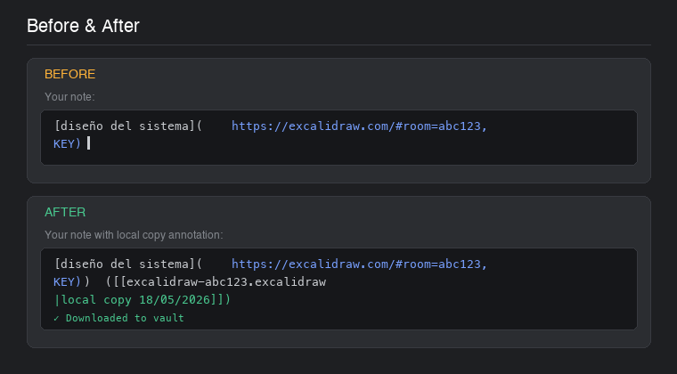
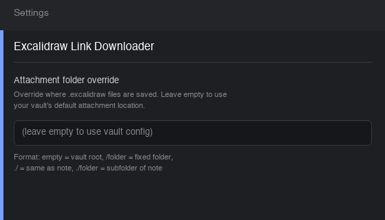

# Excalidraw Link Downloader

Obsidian plugin that downloads Excalidraw shared scenes and collaborative rooms to local `.excalidraw` files, with automatic annotation so you can open them directly from your notes.

> ⚠️ **Desktop Only** — This plugin requires Electron (it uses WebSocket connections and `window.open()`), and is not available on mobile.

---

## Why?

Excalidraw links in your notes are fragile:
- Collaborative rooms expire when no one has them open
- Static scenes can vanish if the author deletes them

This plugin creates permanent local backups and annotates your notes so the drawings stay accessible forever.

---

## Installation

**Option 1: Community Plugins (Pending Approval)**

Once approved, you can install from Community Plugins. Until then, install via BRAT or manual installation:

**Option 2: BRAT (Beta)**
1. Install the [BRAT](https://obsidian.md/plugins?id=obsidian42-brat) plugin
2. In BRAT settings, add: `https://github.com/aranajuan/obsidian-excalidraw-link-downloader`
3. Enable "Excalidraw Link Downloader"

---

## Usage

### Commands

Open the note with Excalidraw links, then run one of these from the command palette:

- **Download Excalidraw links in current file** — Finds and downloads all Excalidraw links in the active note
- **Refresh Excalidraw local copies in current file** — Re-downloads existing links to get the latest version

### How it works

When you run the download command, the plugin:

1. Scans the current note for Excalidraw URLs (`#json=` and `#room=` formats)
2. Downloads each drawing to your vault
3. Adds an annotation showing the local file path

Your notes transform from:

```
[diseño del sistema](https://excalidraw.com/#room=abc123,KEY)
```

To:

```
[diseño del sistema](https://excalidraw.com/#room=abc123,KEY) ([[excalidraw-abc123.excalidraw|local copy 18/05/2026]])
```

Click the wikilink annotation to open the drawing directly in Obsidian (`.excalidraw` files render natively in recent versions, or use [Embedded Notes](https://github.com/obsidian-community/obsidian-embedded-notes) for older setups).

### Screenshots

**Before and After:**



**Settings:**



### Error handling

If a download fails or the room is empty, the annotation shows an error marker:

| Annotation | Meaning |
|-----------|---------|
| `([[excalidraw-ID.excalidraw\|local copy DD/MM/YYYY]])` | Successfully downloaded |
| `(⚠ download failed)` | Download failed, no local copy exists |
| `(⚠ refresh failed)` | Refresh failed, but old local copy is preserved |
| `(⚠ empty canvas — ask the author to open the room, then re-run the downloader)` | Room was empty when checked — ask the room author to open it |

---

## Settings

In **Settings → Excalidraw Link Downloader**:

| Setting | Description |
|---------|-------------|
| Attachment folder override | Override where `.excalidraw` files are saved. Leave empty to use your vault's default attachment location. Format: empty = vault root, `/folder` = fixed folder, `./` = same as note, `./folder` = subfolder of note |

---

## Link types supported

### Static scenes (`#json=`)

```
https://excalidraw.com/#json=ID,KEY
```

Fetched from Excalidraw's static API. These persist until the author deletes them.

### Collaborative rooms (`#room=`)

```
https://excalidraw.com/#room=ID,KEY
```

Connected via WebSocket. The plugin opens your browser to restore the scene from localStorage, then downloads it. Works best when the room is still active.

---

## Idempotency

Running the download multiple times is safe:
- Already downloaded files are skipped
- Links already annotated are skipped
- Failed links are retried

Use **Refresh** to force re-download and update the date.

## Known Limitations

- **Desktop Only**: This plugin is not available on mobile — it relies on Electron's Node.js runtime for WebSocket connections.
- **Browser Tab Required**: Downloading `#room=` (collaborative) links opens your browser to restore the scene from localStorage. A popup blocker may prevent this — a Notice with the URL is shown as fallback.
- **Rate Limits**: Excalidraw may rate-limit requests. If downloads fail, wait a few minutes and try again.
- **Empty Rooms**: If a room has no active participants, the download will return an "empty canvas" annotation. Ask the author to open the room and re-run the downloader.

---

## Also available: CLI tool

This repository also includes a **Go CLI** for batch processing entire vaults:

```bash
go build -o excalidraw-downloader ./cli
./excalidraw-downloader ~/Documents/MyVault
```

See [`cli/README.md`](cli/README.md) for full CLI documentation.